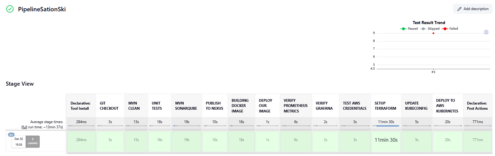

# 🚀 Spring Boot CI/CD Pipeline – Detailed Overview

This repository contains a **Spring Boot project** with a **complete DevOps CI/CD pipeline**.  
The pipeline automates the **entire application lifecycle**: code build, testing, quality analysis, artifact management, containerization, deployment, and monitoring.

---

## ✨ Features

### 🔹 Continuous Integration (CI)
- 🔨 Automatic build from GitHub  
- 🧪 Unit testing (JUnit + mocks)  
- 📊 Code quality analysis with SonarQube  
- 📦 Artifact versioning and publishing to Nexus Repository  

### 🔹 Continuous Delivery (CD)
- 🐳 Docker image build and push  
- ☸️ Deployment to Kubernetes cluster  
- 🔄 Rolling updates & health checks  

### 🔹 Infrastructure as Code (IaC)
- 🏗️ Terraform scripts to provision Kubernetes cluster, networking, and nodes  

### 🔹 Monitoring & Observability
- 📈 Prometheus for metrics collection  
- 📉 Grafana dashboards for CPU, memory, pods, services, and latency 

---

## 🖼️ Screenshots

